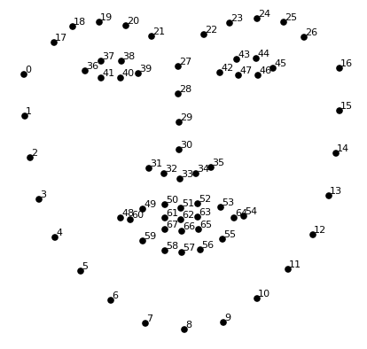
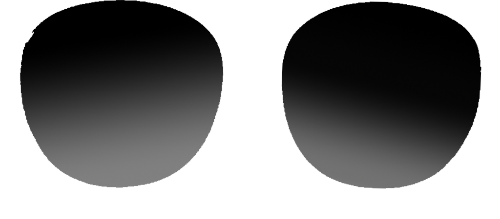
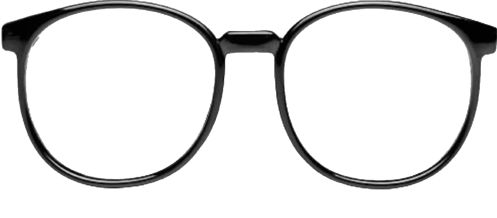
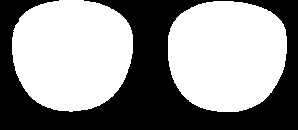
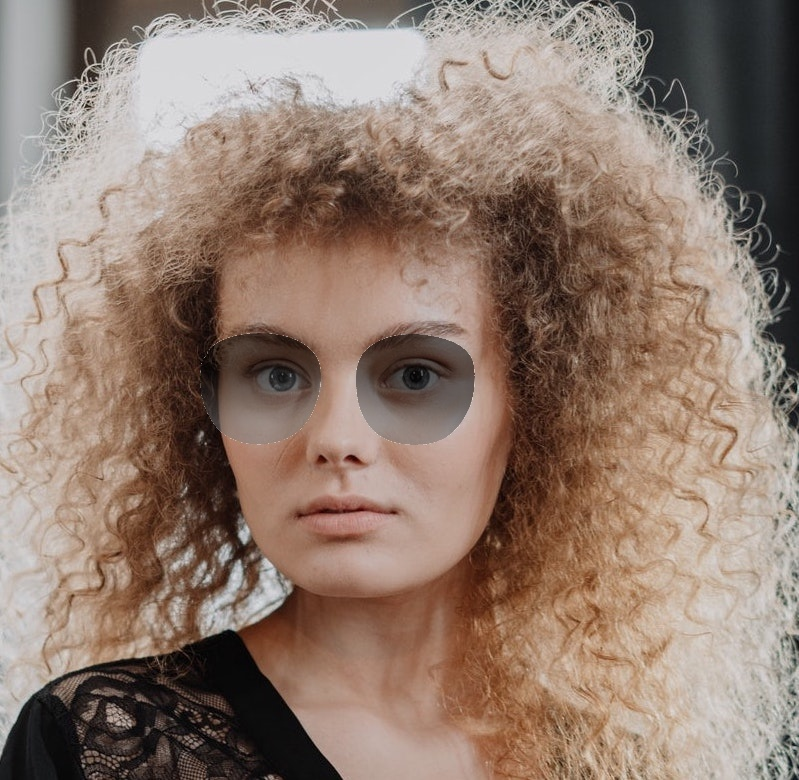
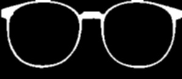

# Apply Glasses
Project1: Virtual Makeup Feature 2.

For Apply Glasses algorithm, we will need to follow the following sequence of steps those are implemented in [main.py](https://github.com/EdissonM/Glasses/blob/master/main.py):

- Detect the facial landmarks using:
    > shape_predictor_68_face_landmarks.dat.

- According 68 landmarks, first we chose points 0 and 16 in x for get width and resize maintain height relations, to avoid  abnormality in glasses image to add.
- also chose points 28 and 20 for locate image glasses, use coordinate (x) in point 28 central nose and 20 in (y) for eyebrown, we will locate glasses image using this new point.
- load lenses image and glasses frame image, independent for add transparency in lenses.

- We will add lenses first, next when add glasses we will cover cut imperfections on lenses.   
- Load image lenses and get lenses mask using threshold.

- Add lenses image in original image located in (x,y) and width, height get using points, after addWeighted using original image and image and lenses for add alpha Weighted, in this case 0.5. This look like polarized lenses.

- 

- Next load image glasses frame, resize according same points(x,y,w,h), get glasses frame mask using binary threshold.
- smooth border doing an erosion using a 3x3 kernel and apply gaussian blur 
- 
  
- Finally, add image glasses frame and his mask  with lenses_image.

